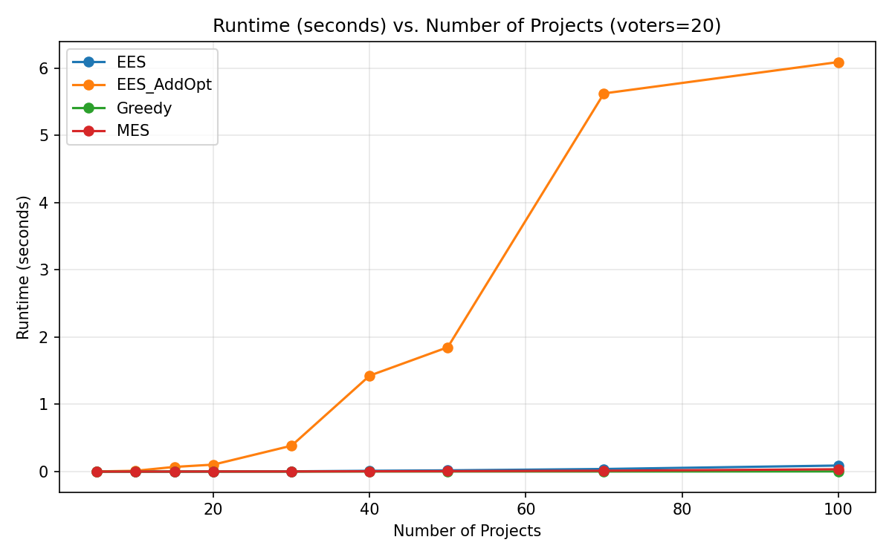
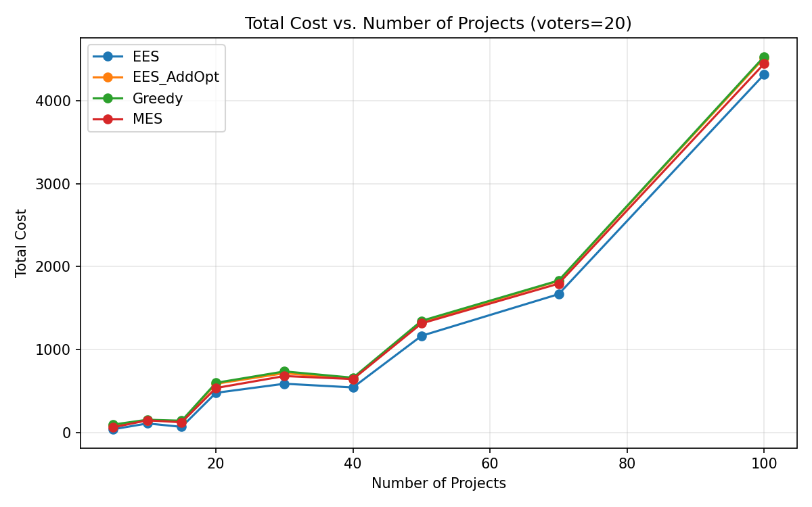
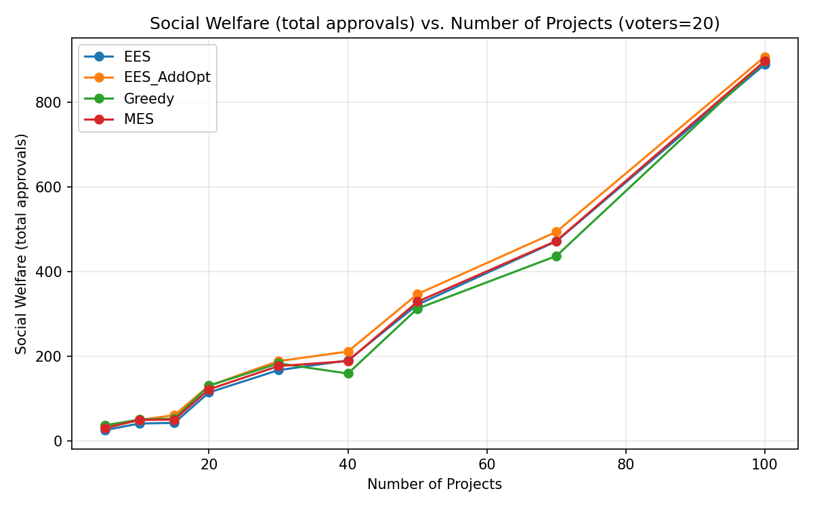
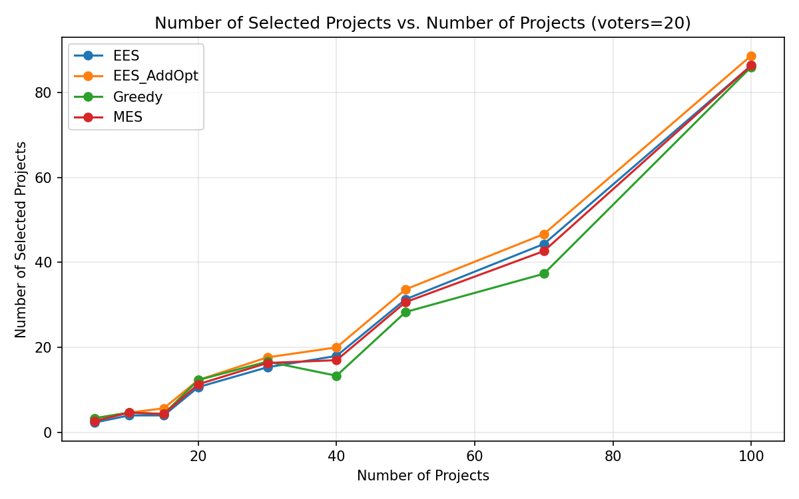

# סעיף א – השוואת ביצועים

## תיאור הניסוי

ניסוי זה משווה את הביצועים של האלגוריתמים מהמאמר
**"Streamlining Equal Shares"** (Kraiczy, Robinson, Elkind, 2024)
מול אלגוריתמים אחרים לתקצוב משתתפים (Participatory Budgeting) מהספרייה `pabutools`.

### אלגוריתמים שנבדקו

| אלגוריתם | תיאור | מקור |
|-----------|--------|------|
| **EES** | Exact Equal Shares (אלגוריתם 1 מהמאמר) – בוחר פרויקטים בצורה חזקנית לפי יחס תועלת/עלות, מחלק עלויות שווה בין התומכים | המאמר, `ees_addopt.py` |
| **EES_AddOpt** | EES + Add-Opt Completion (מסקנה 4.7 מהמאמר) – מריץ EES שוב ושוב עם תקציב וירטואלי עולה עד שהתוצאה ממצה את התקציב | המאמר, `ees_addopt.py` |
| **MES** | Method of Equal Shares – המימוש הסטנדרטי בספרייה, עם Cost Satisfaction | `pabutools.rules.mes` |
| **Greedy** | Greedy Utilitarian Welfare – אלגוריתם חמדני שבוחר פרויקטים לפי ניקוד אישור מסכמי | `pabutools.rules.greedywelfare` |

### מדדים שנמדדו

1. **runtime** – זמן ריצה בשניות
2. **total_cost** – עלות כוללת של הפרויקטים שנבחרו (ניצול תקציב)
3. **social_welfare** – רווחה חברתית: סכום האישורים שכל מצביע נתן לפרויקטים שנבחרו
4. **num_selected** – מספר הפרויקטים שנבחרו

### פרמטרי הניסוי

- **מספר פרויקטים**: 5, 10, 15, 20, 30, 40, 50, 70, 100
- **מספר מצביעים**: 20, 50
- **חזרות**: 3 הרצות עם seeds שונים (1, 2, 3) – הממוצע מוצג בגרפים
- **יצירת קלט**: `get_random_instance` עם עלויות אחידות בין 1 ל-100, ו-`get_random_approval_profile` עם הסתברות אישור 0.5

### כלים

- ספריית `experiments-csv` להגדרת הניסוי, הרצתו, ושמירת התוצאות ב-CSV
- `matplotlib` לציור גרפים

---

## תוצאות

### זמן ריצה




**ממצאים:**
- **Greedy** הוא המהיר ביותר: ~0.005 שניות גם עם 100 פרויקטים
- **MES** מהיר גם כן: ~0.04 שניות עם 100 פרויקטים
- **EES** (אלגוריתם 1) מהיר: ~0.23 שניות עם 100 פרויקטים ו-50 מצביעים
- **EES_AddOpt** האיטי ביותר: ~32 שניות עם 100 פרויקטים ו-50 מצביעים.
  זה בגלל שהוא מריץ EES מספר פעמים עם תקציב וירטואלי עולה, וכל הרצה קוראת גם ל-`add_opt` שמחשב GPC על כל הפרויקטים.

### עלות כוללת (ניצול תקציב)




**ממצאים:**
- **EES** לבדו לא ממצה את התקציב – הוא עוצר מוקדם כשאין עוד פרויקט שניתן לממן באופן שוויוני
- **EES_AddOpt**, **MES**, ו-**Greedy** כולם משיגים ניצול תקציב דומה ומלא יותר
- **Greedy** נוטה לנצל את כל התקציב כי הוא פשוט בוחר את הפרויקט הטוב ביותר כל עוד יש מקום

### רווחה חברתית




**ממצאים:**
- **EES_AddOpt** משיג רווחה חברתית הגבוהה ביותר בממוצע, קצת מעל MES ו-Greedy
- **EES** לבדו נמוך יותר כי הוא לא ממצה את התקציב
- ההבדל בין MES, EES_AddOpt ו-Greedy קטן יחסית – כולם משיגים תוצאות דומות

### מספר פרויקטים שנבחרו




**ממצאים:**
- מספר הפרויקטים שנבחרו עולה עם מספר הפרויקטים הזמינים (כצפוי)
- EES בוחר פחות פרויקטים מכל האחרים כי הוא לא ממצה את התקציב

---

## מסקנות

1. **EES (אלגוריתם 1)** מהיר ויעיל, אבל לא ממצה את התקציב לבדו
2. **EES_AddOpt** ממצה את התקציב ומשיג רווחה חברתית גבוהה, אבל **איטי משמעותית** – זמן הריצה גדל מהר עם מספר הפרויקטים
3. **MES** הסטנדרטי מהספרייה הוא פשרה טובה: מהיר ומשיג תוצאות דומות ל-EES_AddOpt
4. **Greedy** הוא המהיר ביותר אבל לא מבטיח הוגנות (fairness) כמו אלגוריתמי Equal Shares

---

## הרצה

```bash
# הרצת הניסוי + ציור גרפים
py experiments/experiment_comparison.py

# ציור גרפים בלבד (מתוך נתונים קיימים ב-CSV)
py experiments/experiment_comparison.py plot
```

### קבצים

| קובץ | תיאור |
|------|--------|
| `experiment_comparison.py` | סקריפט הניסוי הראשי |
| `results/comparison.csv` | נתוני הניסוי הגולמיים |
| `results/runtime_voters_*.png` | גרפי זמן ריצה |
| `results/total_cost_voters_*.png` | גרפי ניצול תקציב |
| `results/social_welfare_voters_*.png` | גרפי רווחה חברתית |
| `results/num_selected_voters_*.png` | גרפי מספר פרויקטים שנבחרו |
