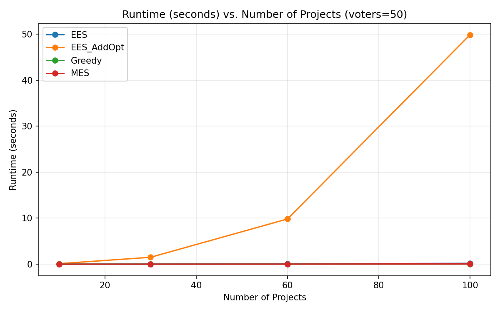
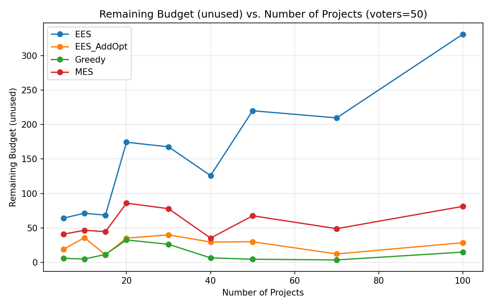
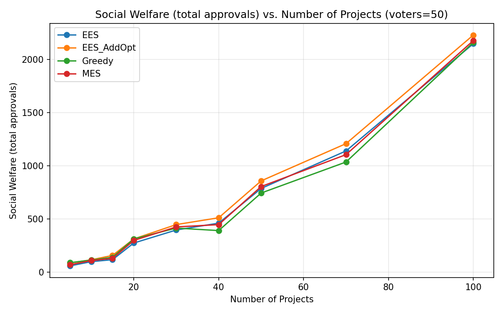
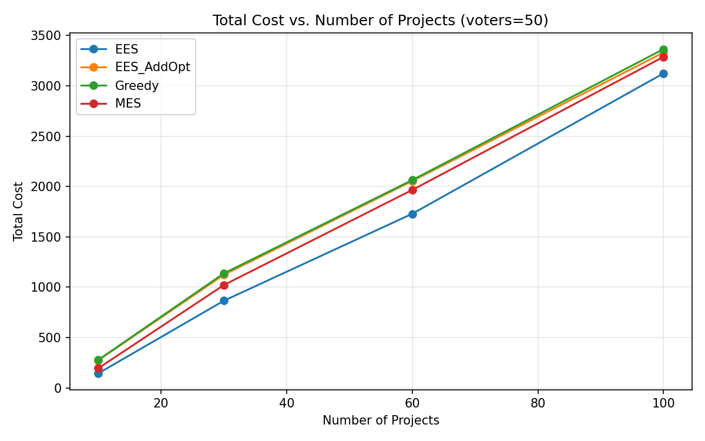
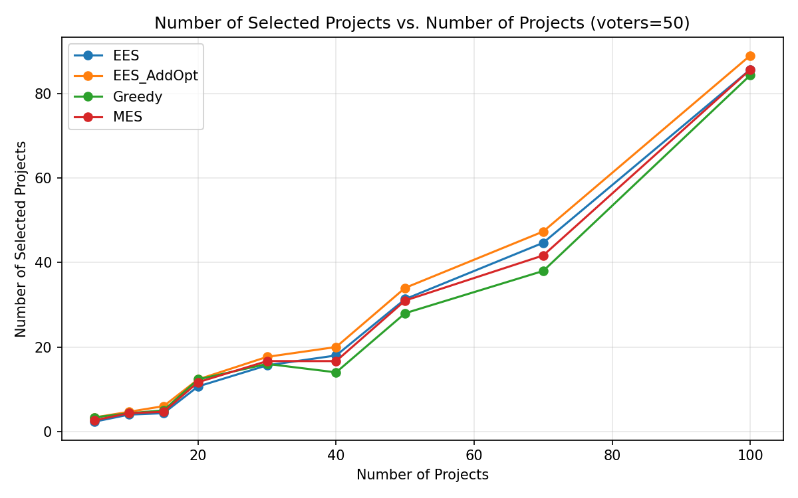

# סעיף א – השוואת ביצועים

## תיאור הניסוי

ניסוי זה משווה את הביצועים של האלגוריתמים מהמאמר
**"Streamlining Equal Shares"** (Kraiczy, Robinson, Elkind, 2024)
מול אלגוריתמים אחרים לתקצוב משתתפים (Participatory Budgeting) מהספרייה `pabutools`.

### אלגוריתמים שנבדקו

| אלגוריתם | תיאור | מקור |
|-----------|--------|------|
| **EES** | Exact Equal Shares (אלגוריתם 1) – בוחר פרויקטים לפי יחס תועלת/עלות, מחלק עלויות שווה בין התומכים | המאמר, `ees_addopt.py` |
| **EES_AddOpt** | EES + Add-Opt Completion (מסקנה 4.7) – מריץ EES שוב ושוב עם תקציב וירטואלי עולה עד שהתוצאה ממצה את התקציב | המאמר, `ees_addopt.py` |
| **MES** | Method of Equal Shares – המימוש הסטנדרטי בספרייה, עם Cost Satisfaction | `pabutools.rules.mes` |
| **Greedy** | Greedy Utilitarian Welfare – אלגוריתם חמדני שבוחר פרויקטים לפי ניקוד אישור | `pabutools.rules.greedywelfare` |

### מדדים שנמדדו

1. **runtime** – זמן ריצה בשניות
2. **remaining_budget** – תקציב שנותר ללא שימוש (budget_limit − total_cost)
3. **total_cost** – עלות כוללת של הפרויקטים שנבחרו
4. **social_welfare** – רווחה חברתית: סך כל האישורים לפרויקטים שנבחרו
5. **num_selected** – מספר הפרויקטים שנבחרו

### פרמטרי הניסוי

כל 4 האלגוריתמים רצים על **אותם הקלטים בדיוק**:

- **מספר פרויקטים**: 10, 30, 60, 100
- **מספר מצביעים**: 50
- **חזרות**: 3 הרצות (seeds: 1, 2, 3) – הממוצע מוצג בגרפים
- **יצירת קלט**: עלויות אקראיות בין 0 ל-100, תקציב = 40%–80% מסך העלויות, הסתברות אישור = 0.4

### כלים

- ספריית `experiments-csv` להגדרת הניסוי ושמירת התוצאות
- `matplotlib` לציור גרפים

---

## תוצאות

### זמן ריצה



| אלגוריתם | 10 פרויקטים | 30 פרויקטים | 60 פרויקטים | 100 פרויקטים |
|-----------|------------|------------|------------|-------------|
| **EES** | 0.002s | 0.03s | 0.07s | 0.18s |
| **EES_AddOpt** | 0.12s | 1.50s | 9.83s | **49.87s** |
| **MES** | 0.004s | 0.01s | 0.02s | 0.05s |
| **Greedy** | 0.001s | 0.002s | 0.006s | 0.01s |

**ממצאים:**
- **Greedy** הוא המהיר ביותר, ואחריו **MES**
- **EES** (אלגוריתם 1 לבדו) מהיר יחסית – 0.18s ב-100 פרויקטים
- **EES_AddOpt** איטי משמעותית: ~50 שניות ב-100 פרויקטים, כי הוא מריץ EES + add_opt מספר פעמים עם תקציבים וירטואליים עולים

### תקציב שנותר (Remaining Budget)



| אלגוריתם | 10 פרויקטים | 30 פרויקטים | 60 פרויקטים | 100 פרויקטים |
|-----------|------------|------------|------------|-------------|
| **EES** | 152 | 279 | 339 | 246 |
| **EES_AddOpt** | **23** | **21** | **14** | **39** |
| **MES** | 102 | 123 | 103 | 82 |
| **Greedy** | 19 | 7 | 4 | 5 |

**ממצאים:**
- **EES** משאיר הכי הרבה תקציב שלא נוצל – הוא עוצר ברגע שאין פרויקט שניתן לממן באופן שוויוני
- **EES_AddOpt** משפר דרמטית את ניצול התקציב: רק 14–39 נותרים, לעומת 152–339 ב-EES הרגיל
- **MES** אמצעי: 82–123 תקציב נותר
- **Greedy** הכי יעיל בניצול תקציב (4–19) אבל לא מבטיח הוגנות

### רווחה חברתית (Social Welfare)



| אלגוריתם | 10 פרויקטים | 30 פרויקטים | 60 פרויקטים | 100 פרויקטים |
|-----------|------------|------------|------------|-------------|
| **EES** | 115 | 448 | 897 | 1505 |
| **EES_AddOpt** | **152** | **514** | **979** | **1555** |
| **MES** | 129 | 472 | 924 | 1453 |
| **Greedy** | 150 | 490 | 899 | 1402 |

**ממצאים:**
- **EES_AddOpt** משיג את הרווחה החברתית הגבוהה ביותר בכל גודל קלט
- ב-100 פרויקטים: EES_AddOpt (1555) > EES (1505) > MES (1453) > Greedy (1402)
- ההבדל בין EES_AddOpt ל-MES גדל עם גודל הקלט

### עלות כוללת ומספר פרויקטים




---

## מסקנות

| | זמן ריצה | ניצול תקציב | רווחה חברתית | הוגנות |
|---|---|---|---|---|
| **EES** | מהיר | נמוך | בינוני | ✓ |
| **EES_AddOpt** | **איטי מאוד** | **גבוה** | **הגבוה ביותר** | ✓ |
| **MES** | מהיר | בינוני | בינוני-גבוה | ✓ |
| **Greedy** | **הכי מהיר** | **הגבוה ביותר** | נמוך יחסית | ✗ |

1. **EES_AddOpt** משיג את התוצאות הטובות ביותר (רווחה חברתית + ניצול תקציב) תוך שמירה על הוגנות – אבל במחיר זמן ריצה גבוה מאוד (~50s ב-100 פרויקטים)
2. **EES** לבדו מהיר אבל לא ממצה את התקציב – מתאים כשלב ביניים
3. **MES** פשרה טובה: מהיר, הוגן, תוצאות סבירות
4. **Greedy** הכי מהיר ומנצל תקציב הכי טוב, אבל לא מבטיח חלוקה הוגנת

---

## הרצה

```bash
# הרצת הניסוי + ציור גרפים
py experiments/experiment_comparison.py

# ציור גרפים בלבד (מתוך נתונים קיימים ב-CSV)
py experiments/experiment_comparison.py plot
```

### קבצים

| קובץ | תיאור |
|------|--------|
| `experiment_comparison.py` | סקריפט הניסוי הראשי |
| `comparison.csv` | נתוני הניסוי הגולמיים |
| `runtime_voters_50.png` | גרף זמן ריצה |
| `remaining_budget_voters_50.png` | גרף תקציב שנותר |
| `total_cost_voters_50.png` | גרף עלות כוללת |
| `social_welfare_voters_50.png` | גרף רווחה חברתית |
| `num_selected_voters_50.png` | גרף מספר פרויקטים שנבחרו |
